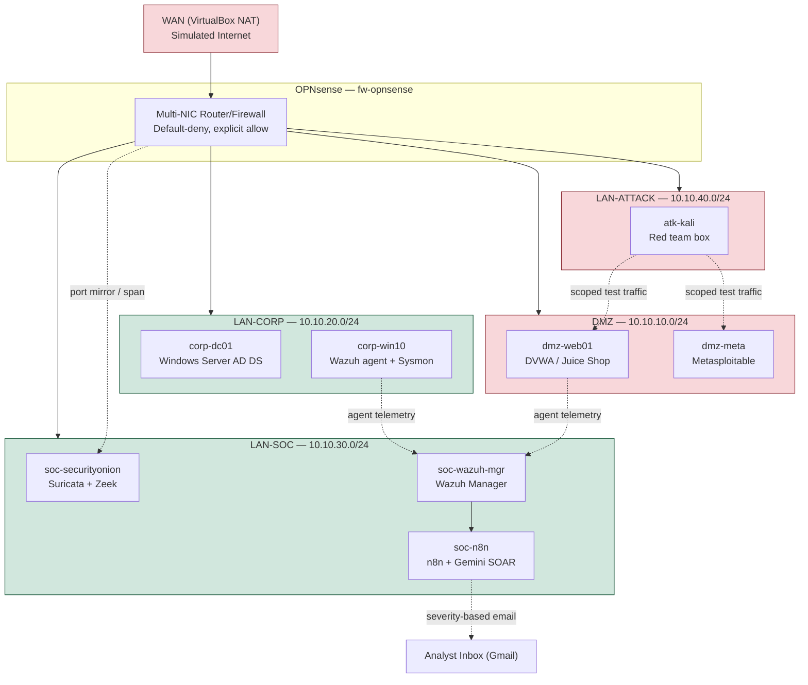

# Network Topology Diagram

Render this on GitHub automatically by viewing this file in the repo, or paste the code block into the [Mermaid Live Editor](https://mermaid.live) for a PNG export to attach to a LinkedIn post or resume.
